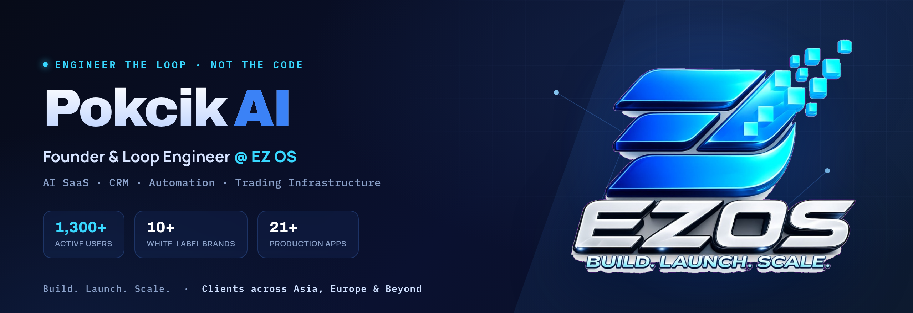

# Pokcik AI

**Founder & Loop Engineer @ [EZ OS](https://ezos.my)**

*I don't write the code — I engineer the loop that writes, ships, and verifies it.*

 

---

## About

EZ OS is an AI-first software company building production systems for real businesses — SaaS platforms, CRM systems, business automation, AI agents, internal tooling, white-label platforms, and trading infrastructure.

I run the full lifecycle: architecture, implementation, deployment, and operations. Every platform below is live in production and serving clients today.

**Loop Engineering** is how I work: instead of writing every line, I design and operate the loop between human intent and autonomous agents — the guardrails, review gates, and verification — so software ships reliably and at scale. The progression: `vibe coding` → `agentic engineering` → **loop engineering**.

**Build. Launch. Scale.**

---

## EZ OS Ecosystem — Production Portfolio

| Platform | Focus |
|----------|-------|
| **EZ OS** | AI Business Platform |
| **PipVerse** | Trading Platform |
| **Pondok Damai** | Community Platform |
| **Mastery Lab** | Learning Platform |
| **MR Ghost** | Premium Trading Community |
| **Kapitan** | Trading Ecosystem |
| **Sarjan** | Learning Ecosystem |
| **Yana Assistant** | AI Assistant |
| **Liza Academy** | Education Platform |
| **IPEC AI** | Enterprise AI |
| **Jarvis OS** | Internal AI Platform |
| **Double i Solution** | Business Solutions |

---

## By The Numbers

- **21+** production applications live on Vercel
- Clients across **Asia, Europe & beyond**
- **AI-first** development
- **Cloud-native** architecture
- **Business-focused** solutions
- **Production-ready** engineering

---

## Global Reach

Serving clients in:

`Malaysia` · `Indonesia` · `Vietnam` · `Hong Kong` · `China` · `Uzbekistan` · `United Kingdom` · `Albania`

---

## Engineering Stack

| Layer | Technology |
|-------|-----------|
| Frontend | Next.js, React, TypeScript |
| Backend & Data | Supabase, PostgreSQL |
| AI | OpenAI, custom AI agents |
| Infrastructure | Vercel, Cloudflare |
| CI/CD | GitHub Actions |

---

## Engineering Principles

- **Production first** — everything ships to real users, not demos
- **Minimal & maintainable** — small, safe changes over clever rewrites
- **AI where it earns its place** — automation that serves the business case
- **Stability over novelty** — client platforms run 24/7; reliability is the feature

---

## Current Focus

- Scaling the EZ OS platform ecosystem
- AI agents for business operations and customer workflows
- Trading infrastructure and signal automation
- White-label SaaS for regional partners

---

## Contact

Building something that needs to work in production?

**[ezos.my](https://ezos.my)** — start there.

© EZ OS — AI-first software, engineered for business.

